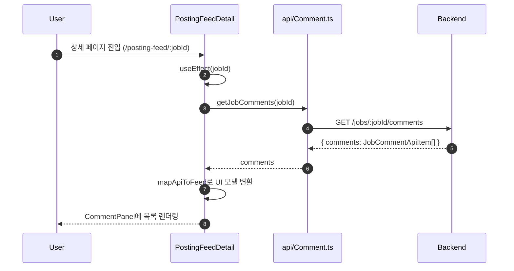
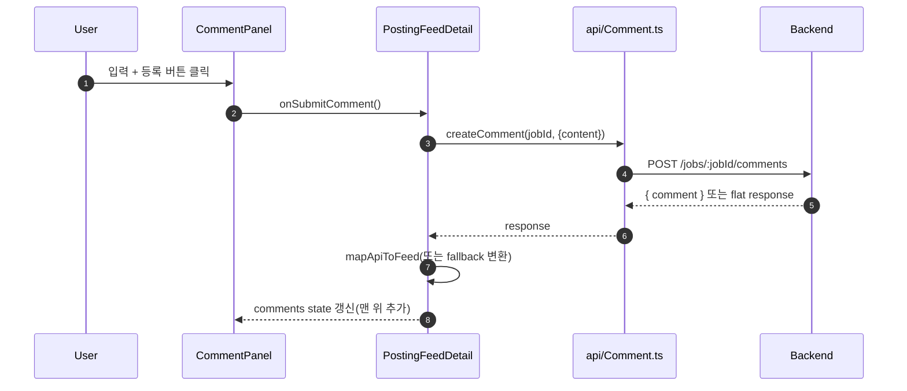
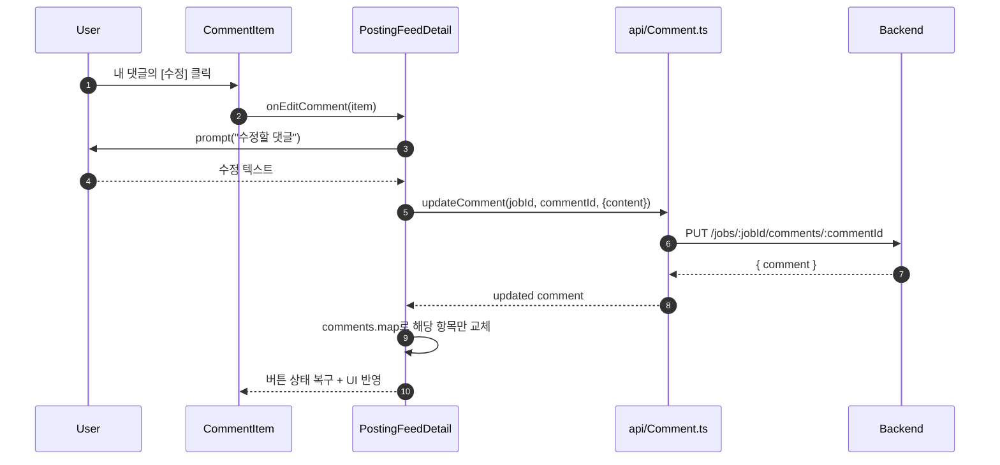
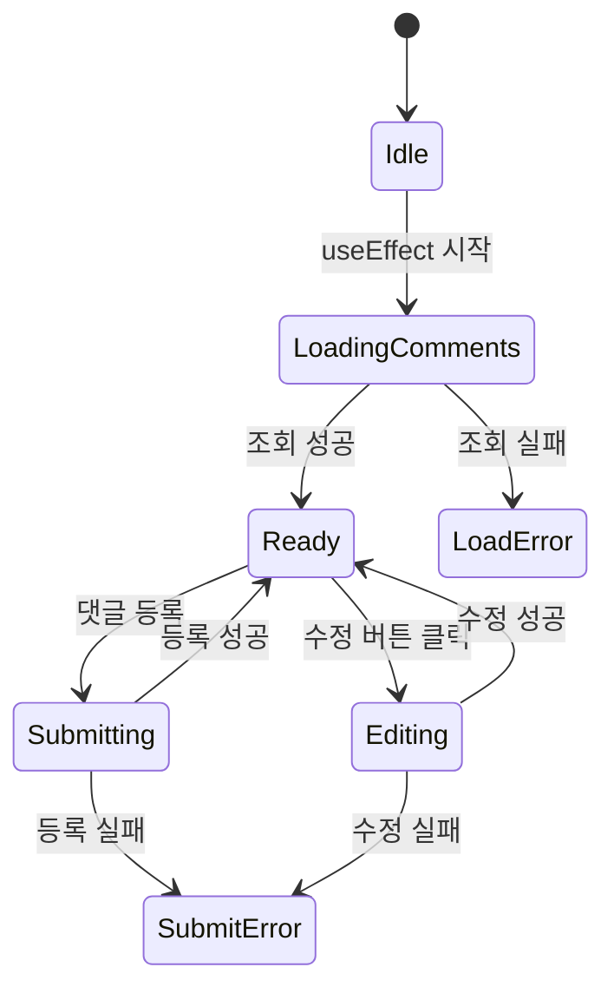

# 댓글 컴포넌트 흐름 문서

이 문서는 `PostingFeedDetail` 기준 댓글 기능의 컴포넌트/데이터 흐름을 다이어그램 중심으로 설명합니다.

## 1) 컴포넌트 구조

```mermaid
flowchart TD
  A[PostingFeedDetail\n(view)] --> B[PostingFeedDetailHeader]
  A --> C[PostingFeedDetailCommentPanel]
  C --> D[PostingFeedDetailCommentItem]
  A --> E[feedComment.ts\nmapApiToFeed]
  A --> F[api/Comment.ts]

  F --> G[getJobComments\nGET /jobs/:jobId/comments]
  F --> H[createComment\nPOST /jobs/:jobId/comments]
  F --> I[updateComment\nPUT /jobs/:jobId/comments/:commentId]
```

## 2) 페이지 초기 진입(댓글 조회)



## 3) 댓글 작성 흐름



## 4) 댓글 수정 흐름



## 5) 상태(State) 의존 관계



## 6) 핵심 포인트

- `PostingFeedDetail`가 상태/핸들러를 소유하고, UI는 `Header`/`Panel`/`Item`으로 분리됨
- 서버 모델(`JobCommentApiItem`)과 UI 모델(`FeedComment`)은 `mapApiToFeed`로 분리
- 작성/수정 후 전체 재조회 없이 로컬 `comments`를 즉시 갱신해 반응성 확보
